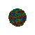

<kbd>

<h2 align="center">Welcome to my profile</h2></kbd>

### Sayantan Das, aka [sayantan98][website], is a computer engineer, expertised in full stack web development !!!

 Eager to learn anything new.  

 A person whom you can mostly need you're facing problem.
 

 Goals: To learn & work with great experience in a healthy work environment
 

 Fun Fact : Being a lazy, always finds a smart way to get completed with less effort. 🤣
 

## Skilled in 👨‍💻 -

### Languages -

[][C]

[][C++]

[][Python]

[][Java]

[][Javascript]

[][Typescript]

[][Ruby]

[website]: https://sayantan98.github.io
[C]: https://img.icons8.com/color/452/c-programming.png
[C++]: https://w7.pngwing.com/pngs/46/626/png-transparent-c-logo-the-c-programming-language-computer-icons-computer-programming-source-code-programming-miscellaneous-template-blue.png
[Python]: http://www.pngall.com/wp-content/uploads/5/Python-PNG-HD-Image.png
[Java]: https://images.vexels.com/media/users/3/166401/isolated/preview/b82aa7ac3f736dd78570dd3fa3fa9e24-java-programming-language-icon-by-vexels.png
[Javascript]: https://p7.hiclipart.com/preview/793/545/309/javascript-programmer-node-js-web-application-vector-markup-language.jpg
[Typescript]: https://cdn.iconscout.com/icon/free/png-512/typescript-1174965.png
[Ruby]: https://lh3.googleusercontent.com/proxy/QrY75CRRTmOReY6p0sTpwGHlHO-2heyrDSQX7NmD0Lhkccp9wHYU367h6UwSICLZFXhhEqyYMX5u_tFJ5FQjukPghYghgb9lwz3LRyMXju6scHnkivx6VQ9YA-8h2vXkV8I